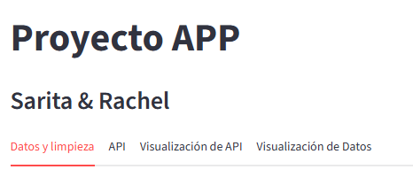
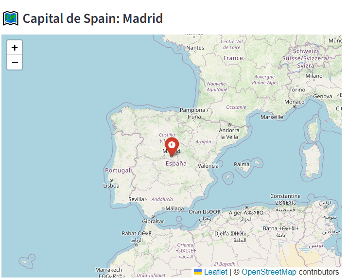

#### 🌍 Mini App de Streamlit (CSV + API + Visualizaciones)




## 🧩  Descripción

Aplicación web desarrollada con **Streamlit*que combina datos locales con una API pública para explorar información geográfica y realizar visualizaciones interactivas. m### 🚀 Funcionalidades principales

✅ Cargar y limpiar un dataset de propiedades en Chile.  
✅ Consultar información de países mediante la API pública **REST Countries**.  
✅ Visualizar la capital del país en un mapa interactivo con **Folium**.  
✅ Explorar comunas de Santiago de Chile en un mapa.  
.

---

## 🧱 Estructura del proyecto-app/
```
├── data/
│    └── pisos_chile_limpio_str
├── images/
│    ├── preview_app.png                # Imagen ilustrativa del proyecto
│    └── map_example.png                # Ejemplo del mapa Foliumeamlit.csv
├── src/
│    ├── api_client.py # Función para consultar REST Countries
│    ├── limpieza.py # Funciones de limpieza de datos
│    └── visualizacion.py # Función show_comuna_map()
├── main.py # Aplicación principal Streamlit
├── requirements.txt # Dependencias del proyecto
└── README.md # Documentación
```
## ⚙️ Instalar dependencias

pip install -r requir

## ⚙️ Ejecutar la aplicacion

streamlit run main.py
ments.txt

## 🏗️ Requisitos del sistema

Python 3.9 o superior

Conexión a Internet (para acceder a la API REST Countries)


#### 🌐 API usada: REST Countries

La app consulta la API pública REST Countries

🔗 Endpoint: Endpoint:

    https://restcountries.com/v3.1/name/{nombre_pais}
    
🧭 Ejemplo:  Ejemplo:

    https://restcountries.com/v3.1/name/Spain  

📦 Devuelve información como:

        Nombre del país

        Capital

        Región

        Población

        Coordenadas de la capitalla capital

#### 🗺️ Visualización con Folium

La pestaña "Visualización de API" muestra un mapa interactivo centrado en la capital del país consultado, con marcador y tooltip pers

Ejemplo visual:



#### 🧹 Limpieza y exploración.

En la pestaña "Datos y limpieza" se pueden aplicar funciones personalizadas del módulo src/limpieza.py :

| Función             | Descripción                                    |
| ------------------- | ---------------------------------------------- |
| `snake_columns(df)` | Renombra columnas al formato *snake_case*.     |
| `open_data(df)`     | Muestra el dataset completo.                   |
| `explore_data(df)`  | Genera estadísticas y visualizaciones básicas. |


#### 📊 Visualización

La pestaña "Visualización de Datos" utiliza src/visualizacion.py para mostrar un mapa de las comunas de Santiago de Foile con folium.

#### 🧑‍💻👩‍💻  Autoras

Sarita & Rachel
Proyecto desarrollado con Python, Pandas, Folium y Streamlit.Streamlit.


